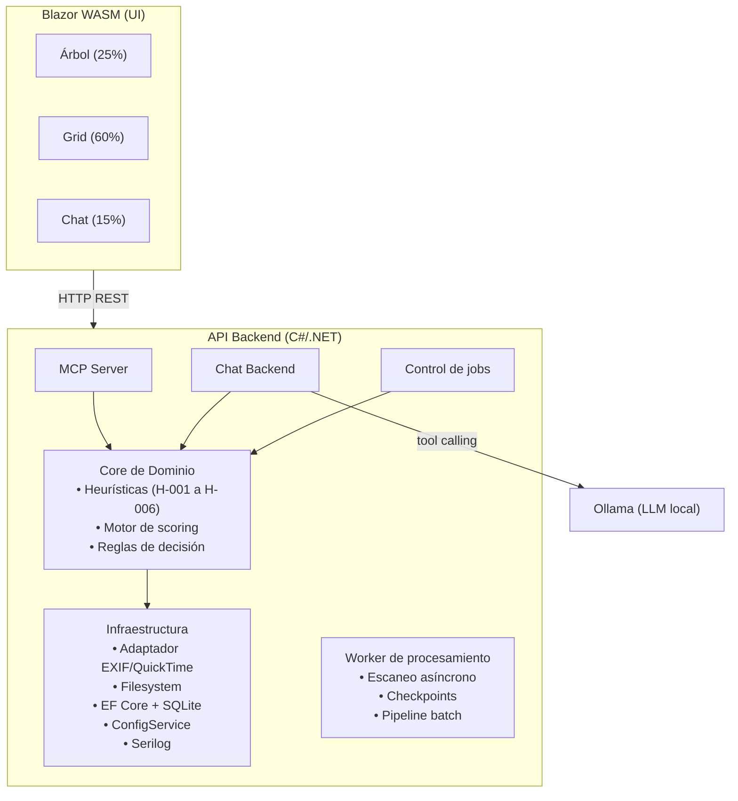

# SnapTime - Arquitectura del sistema

## 1) Arquitectura lógica de módulos

### 1.1) Descripción de módulos

| Módulo | Tecnología | Propósito |
|--------|-----------|-----------|
| UI | Blazor WebAssembly | Interfaz de usuario en 3 paneles. Sin tooling JS. |
| API Backend | C#/.NET | Endpoints REST para UI y control de jobs. |
| MCP Server | C#/.NET | Tools para agentes IA y chat conversacional. Comparte core con API. |
| Chat Backend | C#/.NET | Recibe mensajes del chat, consulta Ollama con tool calling, devuelve respuesta. |
| Core de Dominio | C#/.NET | Heurísticas, scoring, sugerencias, reglas de decisión. Framework-agnóstico. |
| Infraestructura | C#/.NET | Adaptadores EXIF y QuickTime, filesystem, EF Core + SQLite, ConfigService, Serilog. |
| Worker | C#/.NET | Procesamiento asíncrono con checkpoints y cancelación. |

### 1.2) Decisiones tecnológicas por módulo

#### Backend
- Lenguaje obligatorio: C#. Plataforma: .NET.
- Política de versión: última estable disponible en cada iteración mayor.
- Preferencia actual: .NET 10. Fallback: .NET 8 LTS si hay impedimento técnico.

#### UI
- Framework: Blazor WebAssembly. Sin tooling JS (npm, webpack).
- Alternativas descartadas: React + API REST (duplica toolchain), Vue (misma desventaja), Angular (excesivo).
- Consecuencias: mismo lenguaje en frontend y backend; modelos y DTOs compartibles vía proyecto shared; mayor tamaño de descarga inicial.

#### Persistencia
- Motor: SQLite. ORM: EF Core con enfoque code-first (POCO classes en C#).
- Las POCOs en `SnapTime.Domain` son la fuente de verdad del esquema. EF Core genera migrations automáticamente.
- Durante el desarrollo se permite modificar POCOs libremente. No se mantienen archivos SQL manuales.
- Alternativas descartadas: Dapper + SQL manual (bloqueante), ADO.NET raw (sin migraciones), LiteDB (NoSQL, fuera del estándar).

#### Chat conversacional
- LLM local: Ollama. Sin envío de datos a internet.
-- Modelo configurable en BD (tabla `Settings`, columna `OllamaModel`; default: `qwen2.5-coder:14b`).
- El chat backend envía el mensaje al LLM con tool calling sobre las MCP tools.
- El LLM interpreta el mensaje, ejecuta la tool correspondiente y devuelve la respuesta formateada.

#### Configuración
- Modelo híbrido: bootstrap JSON (`snaptime.config.json`) con solo `database.path` y `logging`; runtime en BD (`Settings` + `HeuristicConfig`).
- ConfigService singleton: carga bootstrap del JSON, conecta a BD, carga runtime, expone `Current` combinado.
- Validación de valores antes de aplicar. Cada cambio se registra en auditoría.

#### Logging
- Librería: Serilog. Integración con `Microsoft.Extensions.Logging`.
- Logging estructurado como estándar. Nivel configurable en bootstrap JSON (`snaptime.config.json`).

## 2) Flujo operativo end-to-end
1. Usuario selecciona ruta y parámetros (umbral, concurrencia, filtros).
2. Se crea un job de escaneo y se indexan archivos candidatos.
3. Se extraen metadatos y se normalizan fechas.
4. El motor de heurísticas calcula score y, si procede, sugerencia.
5. Resultados se persisten en SQLite con evidencia.
6. La UI muestra lista/filtros/detalle y permite revisión.
7. Usuario aprueba/rechaza cambios.
8. Sistema ejecuta aplicación real (batch) y registra auditoría. No hay dry-run en el MVP.

## 3) Contratos iniciales (sin implementación)

### API REST (para UI)
| Método | Ruta | Descripción |
|--------|------|-------------|
| POST | `/jobs` | Crear job de análisis |
| POST | `/jobs/{id}/pause` | Pausar job (API/MCP, no expuesto en UI) |
| POST | `/jobs/{id}/resume` | Reanudar job (API/MCP, no expuesto en UI) |
| POST | `/jobs/{id}/cancel` | Cancelar job |
| GET | `/jobs/{id}` | Estado y progreso |
| GET | `/folders/tree` | Árbol de carpetas con estado de selección |
| POST | `/folders/selection` | Actualizar selección en cascada |
| GET | `/photos` | Listado paginado con filtros |
| GET | `/photos/{id}` | Detalle con evidencia |
| GET | `/thumbnails/{photoId}` | Miniatura bajo demanda |
| POST | `/reviews/batch` | Aprobar/rechazar en lote |
| POST | `/apply` | Ejecutar aplicación real (batch) |

### MCP tools (para agentes)
| Tool | Descripción |
|------|-------------|
| `scan_library(root_path, options)` | Iniciar análisis de biblioteca |
| `list_low_confidence(threshold, limit, filters)` | Listar archivos con baja confianza |
| `get_media_evidence(media_id)` | Obtener evidencias de un archivo multimedia |
| `suggest_date(media_id)` | Pedir sugerencia de fecha |
| `apply_fix(media_id, confirm_token)` | Aplicar cambio (commit) |

## 4) Reglas de decisión iniciales (baseline)

### 4.1) Campo canónico de fecha de captura
- Prioridad unificada para fotos y vídeos: `SubSecDateTimeOriginal` → `SubSecCreateDate` → `DateTimeOriginal` → `CreationDate` → `CreateDate` → `MediaCreateDate` → fallback filesystem.
- Al escribir, se fija hora 5:00 AM en todas las correcciones automáticas.
  - Fotos: se escribe en `EXIF:DateTimeOriginal`.
  - Vídeos: se escribe en `QuickTime:CreateDate`.
- Referencia: `docs/00-vision-y-alcance.md §8`.

### 4.2) Reglas baseline
- Penalizar inconsistencias severas entre fecha principal y fechas secundarias.
- Comparar contra tendencia temporal de carpeta/lote.
- Tratar pistas de nombre de carpeta/archivo como evidencia blanda.
- Penalizar paradojas temporales obvias (ej: `mtime` mucho menor que fecha propuesta).

## 5) Modelo de confianza
- Score [0-100] para "fecha actual correcta".
- Estados:
  - >= 80: alta confianza.
  - 50-79: revisar.
  - < 50: sugerir corrección.
- Cada decisión incluye desglose de señales a favor/en contra.

## 6) Plan por fases

### Fase 0 - Requisitos y diseño (actual)
- Cerrar FR/NFR y criterios de aceptación.
- Definir documentación de arquitectura.
- Definir estrategia de pruebas y dataset de evaluación.

### Fase 1 - MVP de análisis (solo lectura)
- Escaneo + extracción de metadatos + scoring baseline.
- Persistencia SQLite.
- UI mínima: árbol + grid miniaturas + detalle inline + chat MCP.

### Fase 2 - Revisión y sugerencias avanzadas
- Filtros avanzados, exportes.
- Aprobación/rechazo por lote (carpeta actual y total escaneado).
- Mejoras de heurísticas de contexto.
- API/MCP estabilizados y versionados.

### Fase 3 - Aplicación controlada de cambios
- Aplicación real con confirmaciones fuertes.
- Auditoría completa y reportes post-operación.

## 7) Riesgos y mitigaciones
| Riesgo | Mitigación |
|--------|-----------|
| Falsos positivos en sugerencias | Umbrales conservadores + revisión humana |
| Jobs largos en bibliotecas enormes | Checkpoints + control de concurrencia |
| Reescrituras peligrosas | Dry-run por defecto + confirmación explícita |
| Complejidad creciente | Documentación como fuente de verdad + versionado de reglas |

## 8) Entregables de la siguiente iteración (sin código)
- Documento de casos de uso (priorizados).
- Especificación de datos (tablas SQLite + índices + estados).
- Matriz de tests de aceptación FR/NFR.
- Backlog inicial (epics → historias → tareas técnicas).
